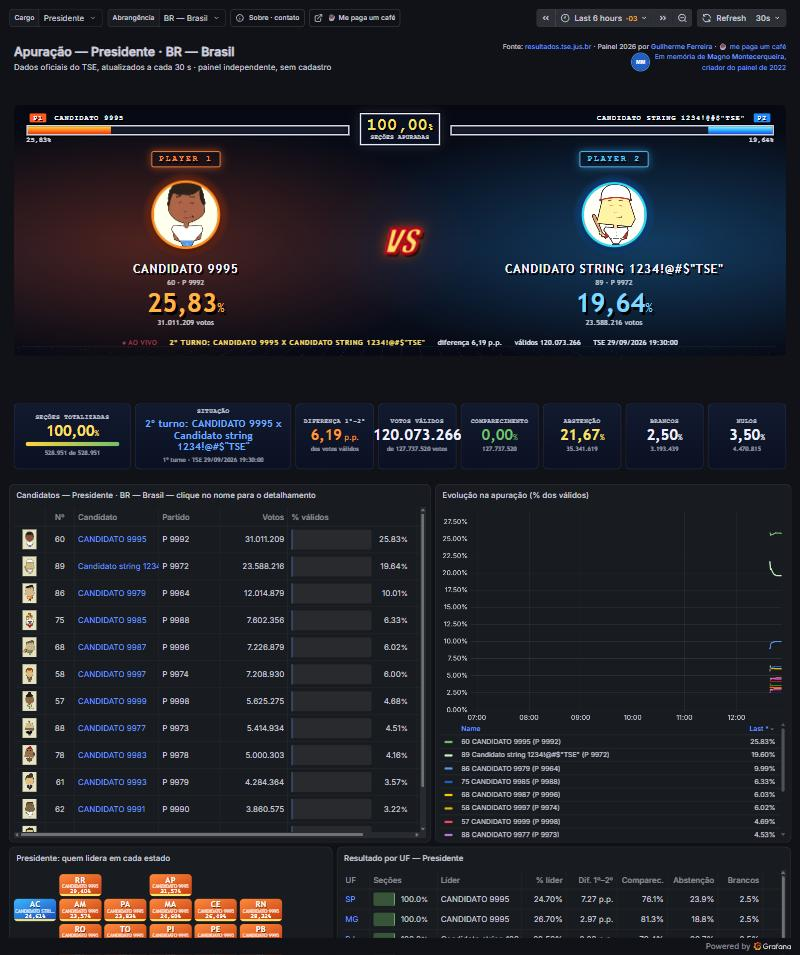
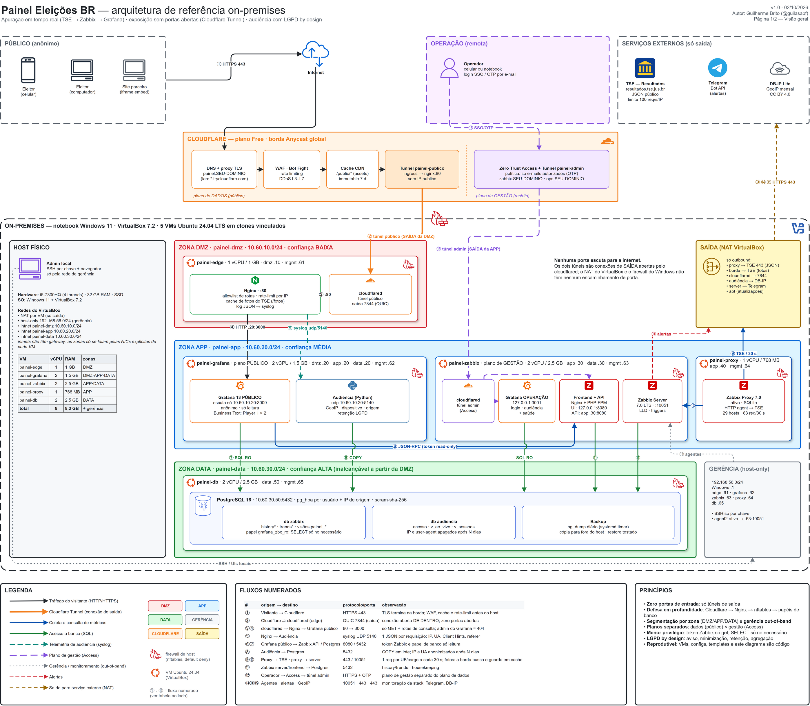
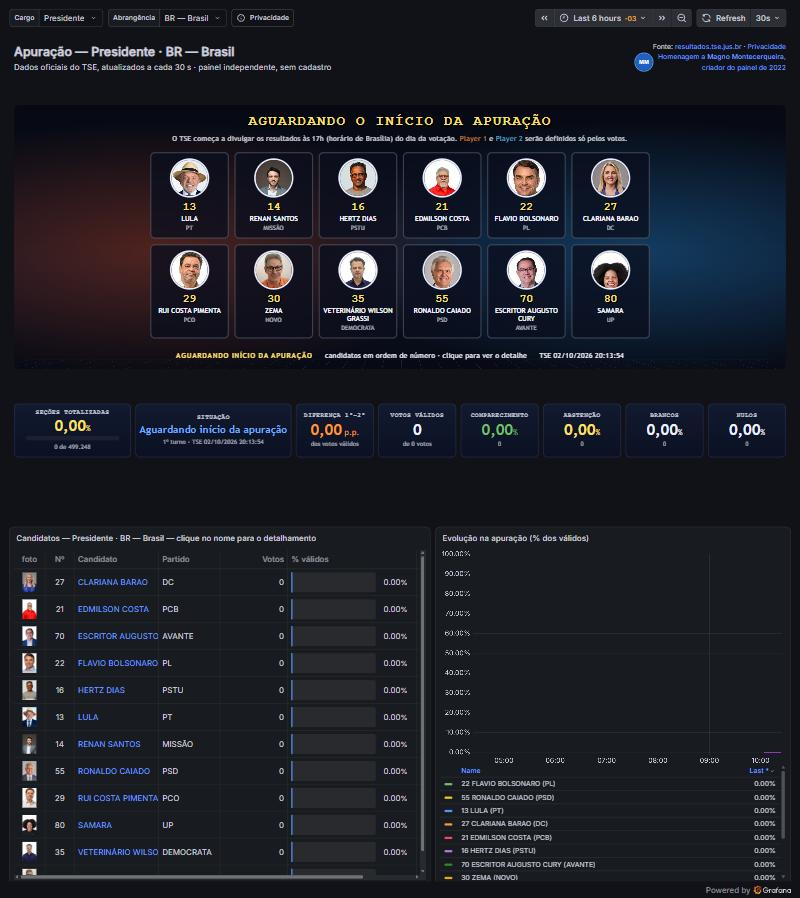
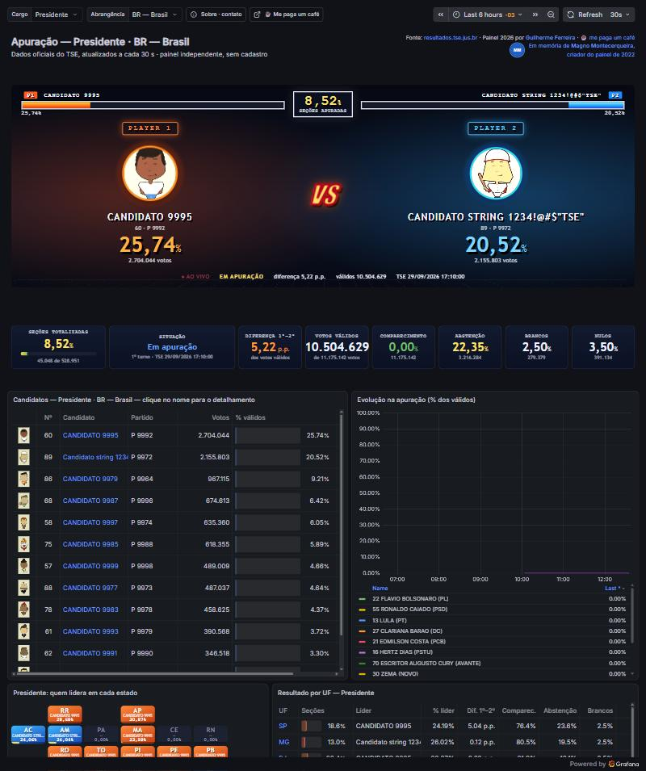

# Dashboard Eleições 2026 — apuração em tempo real com Zabbix e Grafana

Painel público que acompanha a **apuração das Eleições 2026** (Presidente, Governador e Senador, Brasil e as 27 UFs)
em tempo real, a partir dos dados abertos do TSE, com **Zabbix** na coleta e **Grafana** na visualização.

> **Agradecimento ao idealizador, Sansão Simonton** (Telegram: [@sansaoipb](https://t.me/sansaoipb)), a quem devemos a ideia
> do painel de apuração com Zabbix e Grafana para a comunidade Zabbix Brasil.
>
> **Em memória de [Magno Montecerqueira](https://www.linkedin.com/in/magnomontecerqueira/)**, que publicou o
> [Dashboard Eleições 2022](https://grafana.com/grafana/dashboards/17309-zdashboard-elei-es-2022-br/). Esta edição foi
> reescrita do zero para o leiaute de 2026 do TSE, mas a ideia é deles.

**Acesse o painel:** https://guilasabf.github.io/dashboard-eleicoes-2026-zabbix-grafana/

**Endereço direto do painel ao vivo (temporário, muda se o servidor reiniciar):** https://distinction-overseas-near-abstracts.trycloudflare.com

O endereço fixo acima sempre leva ao painel atual.

Tela de um ensaio com apuração sintética e candidatos fictícios do simulado do TSE. Não são resultados reais.

## A ideia em três linhas

Na noite da eleição, o TSE publica os resultados em arquivos JSON abertos. O Zabbix busca esses arquivos a cada 30
segundos, normaliza e descobre os candidatos sozinho; o Grafana mostra o placar. O que este projeto acrescenta é
tratar isso como um serviço de produção: seguro, medido, testado e recuperável, rodando em casa e de graça.

## O que ele demonstra

| Tema | O que foi feito |
| --- | --- |
| Observabilidade | coleta por proxy, itens dependentes, descoberta automática (LLD) de 833 candidatos, triggers, a própria stack monitorada |
| Engenharia de dados | uma camada de normalização isola o painel do formato do TSE; visões materializadas servem os painéis em 10 ms |
| Arquitetura | cinco VMs em zonas separadas (DMZ, aplicação, dados, gestão); plano de dados público e plano de gestão privado |
| Segurança | nenhuma porta de entrada aberta (só túneis de saída), firewall por zona, menor privilégio no banco, visitante anônimo sem escrita |
| Confiabilidade | verificação ponta a ponta em um comando, vigia que religa o túnel, backup de hora em hora, restauração ensaiada em 62 s |
| Desempenho | teste de carga antes de divulgar: de 260 para 1.300 espectadores simultâneos depois de três otimizações |
| Privacidade | audiência própria (cidade, operadora, aparelho) com minimização, retenção e versão agregada sem IP |
| Tudo como código | VMs, firewall, templates do Zabbix, dashboards e até o diagrama de arquitetura são gerados por scripts |

## Arquitetura

Os diagramas C4, a sequência de um ciclo de coleta, os princípios de segurança e a estratégia de testes estão
resumidos em [docs/arquitetura.md](docs/arquitetura.md).

## Números

| | |
| --- | --- |
| Arquivos do TSE lidos a cada 30 s | 83 (Presidente em 28 abrangências, Governador e Senador em 27 UFs) |
| Candidatos descobertos automaticamente | 833, com foto oficial, vice, partido e coligação |
| Verificação ponta a ponta | 16 itens, um comando |
| Testes de blindagem | 41 tentativas de invasão e edição, todas recusadas |
| Capacidade medida | ~1.300 espectadores simultâneos num notebook |
| Custo | R$ 0: software livre, VMs locais e túnel gratuito |

## Telas

| Antes da apuração | Durante o ensaio |
| --- | --- |
|  |  |

O primeiro e o segundo colocados viram **Player 1** e **Player 2**, sempre definidos só pelos votos. Antes do primeiro
voto, o painel mostra todos os candidatos em ordem de número, do mesmo tamanho.

## Por que o código não está aqui

Este repositório é uma vitrine do projeto, não um kit de instalação. O valor está nas decisões e no cuidado de
operação, e é isso que eu quero mostrar. Se você quer algo assim na sua empresa (observabilidade de verdade, painéis
que aguentam audiência, ambiente seguro e documentado), vamos conversar.

**Guilherme Ferreira** · SRE, Cloud e Observabilidade
[LinkedIn](https://www.linkedin.com/in/guilherme-ferreira-aws-sre) ·
[Portfólio](https://www.linkedin.com/in/guilherme-ferreira-aws-sre/details/projects/) ·
[GitHub](https://github.com/guilasabf) ·
[WhatsApp](https://wa.me/5511994946744) ·
guigobrito94@gmail.com

## Passo o bastão

Em 2022 foi o Magno. Em 2026 tive a honra de continuar o trabalho dele, e a comunidade Zabbix e Grafana está de parabéns
por ter mantido essa tradição viva. Nas próximas eleições (municipais de 2028 e gerais de 2030), quem quiser tocar o
painel pode contar comigo: me coloco à disposição para ajudar no que precisar, da arquitetura aos cuidados de
operação na noite da apuração. Parabéns, desde já, a quem topar assumir.

## Como apoiar

- Deixe uma **estrela** neste repositório: é o que faz o projeto aparecer para mais gente.
- **Siga [@guilasabf](https://github.com/guilasabf) no GitHub** e **conecte-se comigo no
  [LinkedIn](https://www.linkedin.com/in/guilherme-ferreira-aws-sre)**.
- **Compartilhe** o painel no dia da apuração.
- **Me pague um café** pelo Pix: chave aleatória `e00b0081-8420-4004-9522-13a0e493c5e6` (o QR Code está na página
  "Sobre" do painel).
  Se cada visitante mandar 10 centavos, eu quito minhas dívidas no Serasa kkkk

## Avisos

Painel independente, sem vínculo com o TSE. Os números vêm de [resultados.tse.jus.br](https://resultados.tse.jus.br) e
valem como divulgados pelo Tribunal. As telas de simulação usam candidatos fictícios. Zabbix e Grafana são marcas de
seus respectivos donos.

---

**English summary.** Real-time dashboard for Brazil's 2026 general election results, built with Zabbix 7.0 (collection
through a proxy, dependent items and low-level discovery of 833 candidates) and Grafana 13 (HTML panels fed by
materialized views in PostgreSQL). It runs on five segmented VMs behind a Cloudflare Tunnel with no inbound ports,
was hardened and load-tested before going public (about 1,300 concurrent viewers on a laptop), and ships with
end-to-end checks, hourly backups and a rehearsed restore. Built in memory of Magno Montecerqueira, author of the
2022 edition. This repository is a showcase; the full source is private.

© 2026 Guilherme Ferreira. Textos, diagramas e imagens deste repositório sob a licença GPL v3 (arquivo LICENSE).
