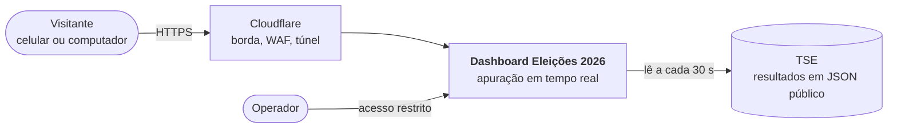
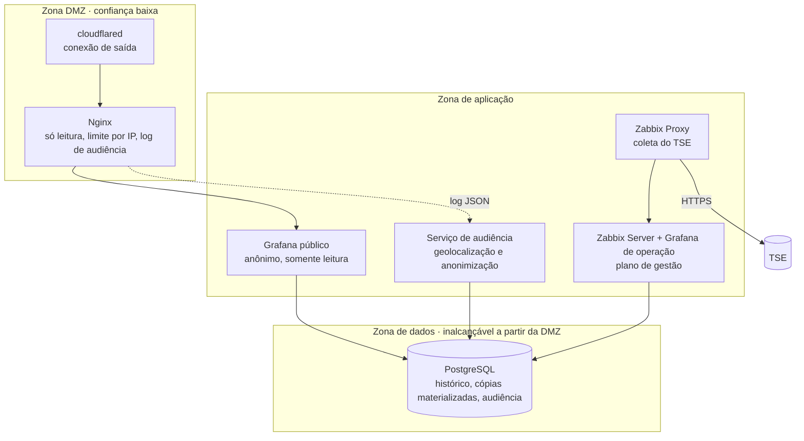
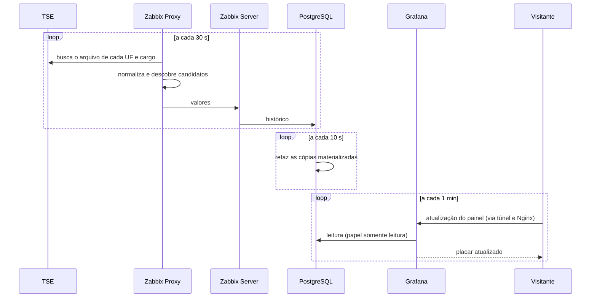

# Arquitetura, segurança e testes — resumo

Este é um resumo de projeto. Os detalhes de implementação (templates, normalizador, provisionamento, regras de
firewall, consultas) ficam no repositório privado.

## C4 · Contexto

## C4 · Containers

## Sequência de um ciclo

## Decisões de arquitetura

| Decisão | Motivo |
| --- | --- |
| Zabbix na coleta, Grafana na visualização | cada ferramenta no que faz melhor; é a combinação que a comunidade conhece |
| Proxy dedicado para falar com o TSE | a coleta fica isolada e só ela tem saída para a internet |
| Camada de normalização entre o TSE e o painel | quando o TSE muda o formato, muda um ponto só |
| Dois Grafanas | o público não tem login nem dados sensíveis; o de operação não é exposto |
| Túnel de saída em vez de porta aberta | o IP de casa não aparece e não há regra de entrada no roteador |
| Cópias materializadas para os painéis | o custo no banco deixa de crescer com a audiência |
| Tudo gerado por código | a próxima eleição muda parâmetros, não arquitetura |

## Segurança

O visitante é anônimo e só lê. Abaixo do painel há três barreiras independentes: a borda aceita apenas as rotas de
leitura e limita cada IP; o Grafana público não tem login, edição, exploração nem as fontes de dados do operador; e o
papel de banco que ele usa é somente leitura, com tempo máximo por consulta e teto de conexões. Dados de audiência com
IP existem só no plano de gestão, com retenção curta e uma versão agregada para compartilhar.

Antes de divulgar, um roteiro automatizado tenta 41 ações que um invasor tentaria (abrir rotas administrativas, salvar
por cima do painel, ler tabelas internas, rodar consultas pesadas, escrever no banco, disparar rajadas). Todas são
recusadas.

## Testes

| Teste | Resultado na véspera |
| --- | --- |
| Verificação ponta a ponta (coleta, descoberta, fotos, painel, túnel, audiência) | 16 de 16 |
| Contrato com o TSE (simulado e oficial) | 83 de 83 arquivos |
| Ensaio de apuração de 0% a 100% | terminou em "2º turno" |
| Blindagem | 41 de 41 tentativas recusadas |
| Carga | 23 atualizações completas por segundo, cerca de 1.300 espectadores |
| Backup e restauração | dump restaurado e conferido; VM restaurada em 62 s |

Os testes pegaram seis defeitos antes da eleição, entre eles um código de eleição errado que só apareceria no dia e um
gargalo que limitava o painel a 260 espectadores.

## Capacidade

O gargalo medido é o Grafana público. Com atualização fixa de 1 minuto, o conjunto responde em menos de 1 segundo até
cerca de 900 espectadores simultâneos e satura perto de 1.300, num notebook de 4 threads. O caminho de escala é
conhecido: mais réplicas do Grafana público atrás da borda e, depois, a mesma topologia numa nuvem gratuita.
